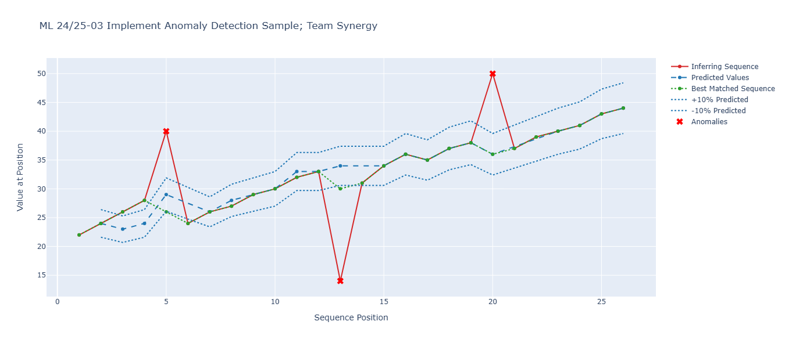

# **ML 24/25-03 Implement Anomaly Detection Sample, Team Synergy**

This project demonstrates how to implement anomaly detection using the NeoCortexApi, a .NET library for Hierarchical Temporal Memory (HTM). HTM is a machine learning framework inspired by the human neocortex, designed for sequence learning, prediction, and anomaly detection.

This sample project is built using .NET 9 and leverages the NeoCortexApi to create a model capable of detecting anomalies in time-series data. Whether you're working with sensor data, financial transactions, or any other sequential data, this project provides a foundation for understanding how HTM can be applied to identify unusual patterns or outliers.

## What is HTM and NeoCortexApi?

Hierarchical Temporal Memory (HTM) is a biologically inspired machine learning framework that mimics the structure and function of the human neocortex. It excels at learning patterns in streaming data and making predictions based on temporal sequences. HTM is particularly well-suited for anomaly detection, as it can identify deviations from learned patterns in real-time.

The NeoCortexApi is a .NET implementation of HTM, providing a powerful and flexible framework for building HTM-based applications. It includes tools for encoding data, training models, and making predictions, making it accessible for developers to integrate HTM into their projects.

## Requirements

To run this project, we need.
* [.NET 9.0 SDK](https://dotnet.microsoft.com/en-us/download/dotnet/9.0)
* Nuget package: [NeoCortexApi Version= 1.1.5](https://www.nuget.org/packages/NeoCortexApi/)

For code debugging, we recommend using visual studio 2022/visual studio code IDE. 

## Project Workflow
The project follows these steps:

*Command-Line Arguments*: Parse input parameters such as file paths and tolerance values.

*File Handling*: Read and validate training and inferring data files.

*Data Parsing*: Parse CSV files into sequences of numerical data.

*Sequence Analysis*: Analyze sequences to find the maximum value for encoding.

*HTM Training*: Train the HTM model using the training sequences.

*Anomaly Detection*: Detect anomalies in the inferring sequences using the trained model.

## Step-by-Step Explanation

### Step 1: Command-Line Arguments

The project starts by parsing command-line arguments to configure the anomaly detection system. The [ConsoleArgumentsHandler](https://github.com/Muhammad-Talha-S/synergy-neocortex-ad/blob/master/source/MySEProject/AnomalyDetectionTeamSynergy/ConsoleArgumentsHandler.cs) class handles this by extracting values for parameters such as file paths, folder paths, and numerical settings.

#### Key Parameters and Default Values

* *N*: Trims the first N elements of inferring sequences. (Default: 0)
* *trainingFile*: Path to the training data file. (Default: Empty string)
* *inferringFile*: Path to the inferring (testing) data file. (Default: Empty string)
* *trainingFolder*: Path to the folder containing multiple training files. (Default: Empty string)
* *inferringFolder*: Path to the folder containing multiple inferring files. (Default: Empty string)
* *toleranceValue*: Sets the sensitivity threshold for anomaly detection. (Default: 0.1)

If no arguments are provided, the application uses the above defaults.

#### Usage Example

Run the application with command-line arguments as follows:

```bash
dotnet run --n 5 --training-file "data/training.csv" --inferring-file "data/inferring.csv" --tolerance 0.1
```

### Step 2: File Handling

The [FileHandler](https://github.com/Muhammad-Talha-S/synergy-neocortex-ad/blob/master/source/MySEProject/AnomalyDetectionTeamSynergy/FileHandler.cs) class manages file operations for training and inferring data. It gathers, validates, and filters CSV files from specified paths or default folders.

#### Key Features:
* *Default Folders*: Automatically uses TrainingData and InferringData folders in the project's base directory if no paths are provided.

* *File Validation*: Ensures files exist and have a .csv extension.

* *Flexible Input*: Accepts individual files or folders for both training and inferring data.

```csharp
private List<string> ValidateAndFilterFiles(List<string> files)
{
    var validFiles = new List<string>();

    foreach (var file in files)
    {
        if (!File.Exists(file))
        {
            Console.WriteLine($"Warning: File not found - {file}");
            continue;
        }

        if (!IsCsv(file))
        {
            Console.WriteLine($"Warning: File is not a CSV - {file}");
            continue;
        }

        validFiles.Add(file);
    }

    return validFiles;
}
```

#### Usage:

* *Training Data*: Provide a specific file (--training-file) or folder (--training-folder). If none are provided, it defaults to the TrainingData folder.

* *Inferring Data*: Provide a specific file (--inferring-file) or folder (--inferring-folder). If none are provided, it defaults to the InferringData folder.


### Step-3 CSV Handling and HTM Input

This step involves reading, parsing, and transforming CSV data into a format suitable for HTM (Hierarchical Temporal Memory) training and inference. The [CSVHandler](https://github.com/Muhammad-Talha-S/synergy-neocortex-ad/blob/master/source/MySEProject/AnomalyDetectionTeamSynergy/CSVHandler.cs) class handles CSV file operations, while the [CSVToHTMInput](https://github.com/Muhammad-Talha-S/synergy-neocortex-ad/blob/master/source/MySEProject/AnomalyDetectionTeamSynergy/CSVtoHTMInput.cs) class converts sequences into HTM-compatible input.

#### Key Features:

*CSV Parsing*:

* Reads CSV files and extracts numerical sequences.

* Skips invalid lines and sequences with fewer than 3 values.

* Supports trimming sequences by removing the first N elements.

```csharp
public List<List<double>> ParseSequencesFromCSV(string filePath)
{
    var sequences = new List<List<double>>();
    var lines = File.ReadAllLines(filePath);

    for (int i = 1; i < lines.Length; i++) // Skip header
    {
        var values = lines[i].Split(',', StringSplitOptions.RemoveEmptyEntries);
        if (values.All(v => double.TryParse(v, NumberStyles.Any, CultureInfo.InvariantCulture, out _)))
        {
            var sequence = values.Select(v => double.Parse(v, CultureInfo.InvariantCulture)).ToList();
            if (sequence.Count > 2) sequences.Add(sequence); // Skip sequences with < 3 values
        }
    }
    return sequences;
}

public List<List<double>> TrimSequences(List<List<double>> sequences, int N)
{
    return sequences.Select(seq => seq.Skip(N).ToList()).ToList();
}
```

*HTM Input Transformation*:

* Converts sequences into a dictionary format required for HTM training.

* Assigns unique keys to each sequence for identification.

```csharp
public Dictionary<string, List<double>> BuildHTMInput(List<List<double>> sequences, string keyPrefix = "S")
{
    var dictionary = new Dictionary<string, List<double>>(sequences.Count);
    for (int i = 0; i < sequences.Count; i++)
    {
        dictionary[$"{keyPrefix}{i + 1}"] = sequences[i]; // Assign unique keys
    }
    return dictionary;
}
```

*Data Saving*:

* Saves inferring sequences, predicted values, and best-matched sequences to a CSV file for analysis.

```csharp
public void SaveToCsv(string csvFileName, List<double> inferringSequence, List<string> predictedValues, List<double> bestMatchedSequence)
{
    string folderPath = Path.Combine(projectBaseDirectory, "ModelPredictions");
    Directory.CreateDirectory(folderPath);

    using (StreamWriter writer = new StreamWriter(Path.Combine(folderPath, csvFileName)))
    {
        writer.WriteLine("Inferring Sequence,Predicted Values,Best Matched Sequence");
        for (int i = 0; i < Math.Max(inferringSequence.Count, predictedValues.Count); i++)
        {
            writer.WriteLine($"{inferringSequence[i]},{predictedValues[i]},{bestMatchedSequence[i]}");
        }
    }
}
```

### Step 4 Sequence Analyzer

The [SequenceAnalyzer](https://github.com/Muhammad-Talha-S/synergy-neocortex-ad/blob/master/source/MySEProject/AnomalyDetectionTeamSynergy/SequenceAnalyzer.cs) class computes statistical properties from training and inferring sequences. These properties are used in subsequent steps for HTM training and anomaly detection.

#### Key Methods:

*FindMaxValue*:

* Combines all sequences and finds the maximum value.

* This value is used to configure the Scalar Encoder in HTM training.

```csharp
public double FindMaxValue()
{
    var combinedSequences = all_training_sequences.SelectMany(x => x)
                                                 .Concat(all_inferring_sequences.SelectMany(x => x))
                                                 .ToList();
    return combinedSequences.Max();
}
```

*FindDifferenceBetweenTwoMinValues*:

* Combines all sequences and calculates the difference between the two smallest values.

* This difference is used as the relative threshold for anomaly detection.

```csharp
public double FindDifferenceBetweenTwoMinValues()
{
    var combinedSequences = all_training_sequences.SelectMany(x => x)
                                                 .Concat(all_inferring_sequences.SelectMany(x => x))
                                                 .ToList();
    var sortedSequences = combinedSequences.OrderBy(x => x).Take(2).ToList();
    return sortedSequences[1] - sortedSequences[0];
}
```

### Step 5  HTM Training

The [MultiSequenceLearning](https://github.com/Muhammad-Talha-S/synergy-neocortex-ad/blob/master/source/MySEProject/AnomalyDetectionTeamSynergy/MultiSequenceLearning.cs) class trains the HTM model using the sequences prepared in Step 4. The maxValue from FindMaxValue is used to configure the Scalar Encoder.

#### Key Steps:

*Input Preparation*:

* Sequences are converted into a dictionary format using [CSVHandler](https://github.com/Muhammad-Talha-S/synergy-neocortex-ad/blob/master/source/MySEProject/AnomalyDetectionTeamSynergy/CSVHandler.cs).

```csharp
var htmTrainingSequence = csvHtmInput.BuildHTMInput(allTrainingSequences);
```

*HTM Configuration*:

* The *maxValue* is used to configure the encoder.

```csharp
double max = this.maxValue;

Dictionary<string, object> settings = new Dictionary<string, object>()
{
    { "W", 15},
    { "N", inputBits},
    { "Radius", -1.0},
    { "MinVal", 0.0},
    { "Periodic", false},
    { "Name", "scalar"},
    { "ClipInput", false},
    { "MaxVal", max}
};

EncoderBase encoder = new ScalarEncoder(settings);
```

*Training*

* The *Run* method trains the model and returns a *Predictor* object.

```csharp
MultiSequenceLearning learning = new MultiSequenceLearning(maxValue);
var predictor = learning.Run(htmTrainingSequence);
```

### Step 6 Anomaly Detection

The [AnomalyDetection](https://github.com/Muhammad-Talha-S/synergy-neocortex-ad/blob/master/source/MySEProject/AnomalyDetectionTeamSynergy/AnomalyDetection.cs) class uses the trained *Predictor* object to detect anomalies in the inferring sequences. The *relativeThreshold* from *FindDifferenceBetweenTwoMinValues* and the tolerance are used to determine anomalies.

#### Key Features:

*Anomaly Detection Logic*:

* Compares predicted and actual values using the IsAnomaly method.

```csharp
public bool IsAnomaly(double predictedValue, double actualValue)
{
    double absoluteDifference = Math.Abs(predictedValue - actualValue);
    double relativeDifference = absoluteDifference / actualValue;

    bool exceedsThreshold = absoluteDifference > this.threshold; // threshold from Step 4
    bool exceedsTolerance = relativeDifference > this.tolerance; // tolerance from user input

    return exceedsThreshold && exceedsTolerance;
}
```

*Inference and Anomaly Detection*:

* The *Predictor* object is used to predict the next value in the sequence.

```csharp
public void DetectAnomaly(Predictor predictor, List<double> inferringSequence, string csvFileName)
{
    for (int i = 0; i < inferringSequence.Count - 1; i++)
    {
        double currentValue = inferringSequence[i];
        double actualNextValue = inferringSequence[i + 1];
        var predictionList = predictor.Predict(currentValue);

        if (predictionList.Count > 0)
        {
            var topPrediction = predictionList.First();
            double predictedNextValue = double.Parse(topPrediction.PredictedInput.Split('-').Last());

            bool isAnomalous = IsAnomaly(predictedNextValue, actualNextValue);
            if (isAnomalous)
            {
                Console.WriteLine("!!! Anomaly Detected !!!");
                i++; // Skip next element
            }
        }
    }
}
```

*Saving Results*:

* Results are saved to a CSV file using the [CSVHandler](https://github.com/Muhammad-Talha-S/synergy-neocortex-ad/blob/master/source/MySEProject/AnomalyDetectionTeamSynergy/CSVHandler.cs) class.

```csharp
var csvWriter = new CSVHandler();
csvWriter.SaveToCsv(csvFileName, inferringSequence, predictedValues, bestMatchedSequence);
```

## Experiment Results

| **Processing Element** | **Predicted Next Value** | **Actual Next Value** | **Anomaly Flag** | **Expected** | **Found** |
|-----------------------:|:------------------------:|:---------------------:|:----------------:|:------------:|:---------:|
|         22             |             24           |          24           |        NO        |              |           |
|         24             |             26           |          23           |        NO        |              |           |
|         26             |             28           |          24           |        NO        |              |           |
|         28             |             40           |          29           |        NO        |              |           |
|         24             |             26           |          26           |        NO        |              |           |
|         26             |             27           |          24           |        NO        |              |           |
|         27             |                          |                       |        NO        |              |           |
|         29             |             30           |          30           |        NO        |              |           |
|         30             |             32           |          33           |        NO        |              |           |
|         32             |             14           |          34           |        NO        |              |           |
|         31             |             34           |          34           |        NO        |              |           |
|         34             |             36           |          36           |        NO        |              |           |
|         36             |             35           |          35           |        NO        |              |           |
|         35             |             37           |          37           |        NO        |              |           |
|         37             |             38           |          38           |        NO        |              |           |
|         38             |             50           |          36           |        NO        |              |           |
|         37             |                          |                       |        NO        |              |           |
|         39             |             40           |          40           |        NO        |              |           |
|         40             |             41           |          41           |        NO        |              |           |
|         41             |             43           |          43           |        NO        |              |           |
|         43             |             44           |          44           |        NO        |              |           |

---

### Line Charts for Sample Anomaly Detection




## Resources
[NeoCortexApi GitHub Repository](https://github.com/ddobric/neocortexapi)

[Numenta](https://www.numenta.com/resources/htm/htmschool/)